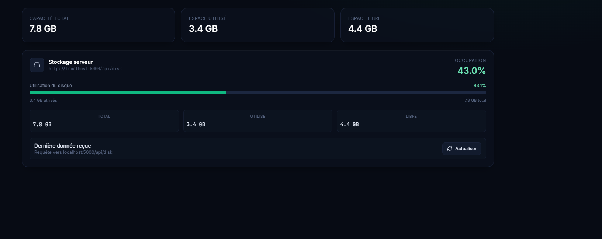
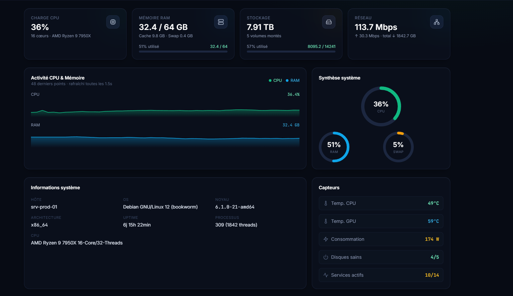
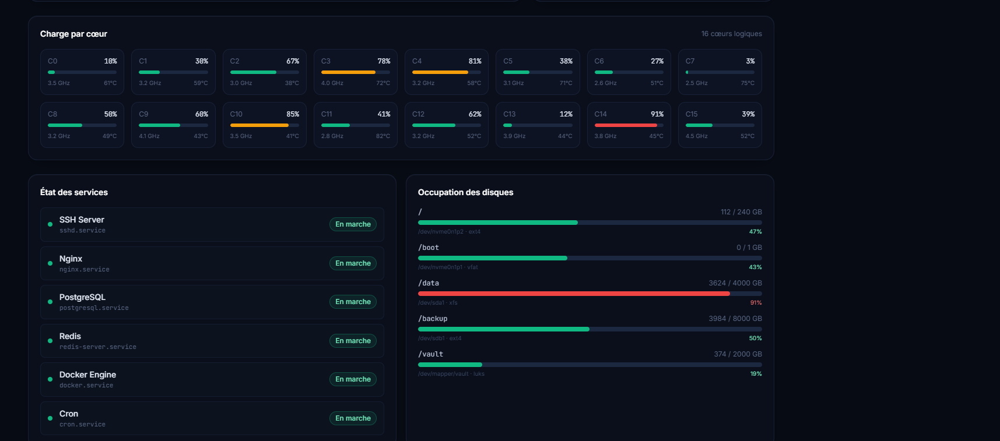

# Linux-Monitor

**linux-monitor** is a Linux software designed to deeply monitor your machine’s status.  
It provides highly detailed information about the system, performance metrics, resource usage, and active processes.  
Thanks to a panel created specifically for this tool, reading and understanding the data is simple, clear, and user‑friendly.

## Pictures 

## Functionalities

- Real‑time system monitoring — CPU, RAM, disk, network and processes
- Advanced system metrics — detailed kernel, I/O and hardware statistics
- Custom monitoring panels — clear, modern and easy‑to‑read interface
- Automatic background scanning — periodic checks of system activity
- Multi‑channel alerts — notifications when thresholds are exceeded:
  - Discord (webhook)
  - Telegram (bot + chat ID)
  - Email (SMTP)
  - HTTP Webhook
- Resource usage history — long‑term graphs and trends
- Process inspection — detailed view of active tasks and their consumption
- System health overview — global status with warnings and critical alerts
- Persistent configuration — settings and state stored in `data/`
- Lightweight footprint — optimized for minimal resource usage

## Download

...

## Contributors

